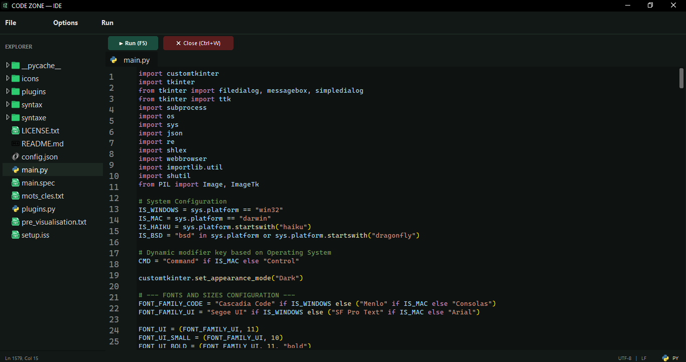

# CODE ZONE - Your Lightweight & Fast IDE

[](https://opensource.org/licenses/MIT)

## About
CODE ZONE is a fast and lightweight IDE (under 100MB) capable of running on any machine and operating system (Windows, Linux, macOS, Haiku, and BSD). It was designed as a blend between the aesthetic and usability of VS Code, the simplicity of Sublime Text / Geany, and the efficiency of Code::Blocks. It supports a wide variety of programming languages and allows you to easily edit and execute new or custom languages without hassle.



## Key Features
- **Ultra Lightweight & Fast:** Runs seamlessly on low-spec hardware with minimal system resource consumption.
- **Smart Auto-Save Handling:** Direct run execution without tedious manual save cycles—just press `F5`.
- **Instant HTML Preview:** Launch HTML files directly in your default Web Browser using `F5`.
- **Integrated Markdown Viewer:** Built-in lightweight Markdown renderer (experimental, text & structure preview).
- **Flexible Path & Toolchain Management:** Easily configure executable paths for any language, including custom and niche ones.
- **Extensible via Python Plugins:** Written in Python, making it fully customizable with scriptable plugins.

---

## Requirements

Before running CODE ZONE, ensure you have **Python 3.8+** installed along with the required dependencies.

### Core Dependencies
- `tkinter`
- `customtkinter`
- `Pillow` (PIL)

---

## Installation

### 1. Clone or Download the Repository
```bash
git clone [https://github.com/damixlord2-0/code-zone.git](https://github.com/damixlord2-0/code-zonecode.git)
cd code-zone
```

## 2. Install Python Dependencies
Install the required packages using pip:

```
pip install customtkinter pillow
```

### Operating System Specific Instructions
#### 🪟 Windows
- Make sure Python is added to your system PATH.
- Launch the application by double-clicking main.py or running:
```
python main.py
```
#### 🐧 Linux & 😈 BSD

Install Python 3, pip, and tkinter via your package manager if not already available:

Ubuntu / Debian / Raspbian:

```
sudo apt update
sudo apt install python3 python3-pip python3-tk
```

Arch Linux:

```
sudo pacman -S python python-pip tk
```

#### FreeBSD / OpenBSD:

```
sudo pkg install python3 py311-tkinter
```

Install dependencies & run:
```
pip install customtkinter pillow
python3 main.py
```

#### 🍎 macOS
Ensure Python 3 is installed (via python.org or Homebrew):

```
brew install python python-tk
```

Install requirements and launch:

```
pip3 install customtkinter pillow
python3 main.py
```

#### 🍃 Haiku OS
Install Python 3 and Tkinter using pkgman:

```
pkgman install python3 python3_tkinter
```
Install packages and start CODE ZONE:

```
pip3 install customtkinter pillow
python3 main.py
```

### License
This project is licensed under the MIT License - see the LICENSE file for details.

### The website

https://www.codezone.github.io
